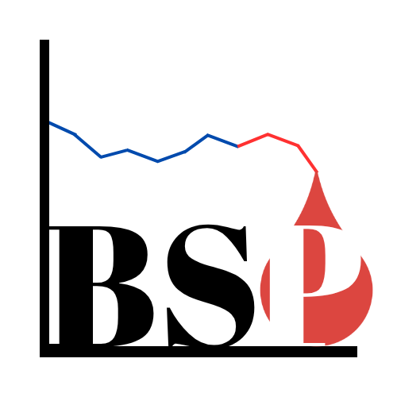
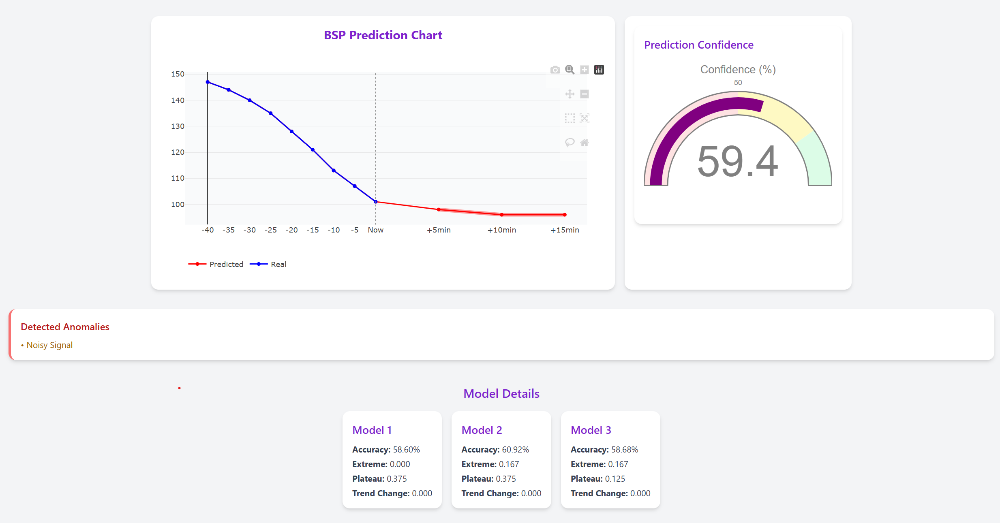

# BSP Web App – Blood Sugar Prediction Dashboard

  

  <b>Real-time blood sugar prediction and trend visualization for Type 1 diabetics.</b> 
  Built with modern technologies to provide fast, intuitive, and secure forecasting.

---

## 🚀 **Overview**

**BSP (Blood Sugar Predictor)** is a cutting-edge project designed to predict short-term blood glucose trends using machine learning.  
The web app offers:
- **Fast, on-demand inference** (optimized ML models).
- **Clean, user-friendly UI** with a responsive design.
- **Seamless deployment and modern stack** powered by Vite, React, and Tailwind CSS.

> ⚠ **Disclaimer:** This project is **for research and educational purposes only** and does not provide medical advice.

---

## ✨ **Key Features**

- **🔮 Predictive Insights:** Displays the latest 12 real-time glucose values with 3 predicted values ahead.
- **📈 Interactive Graphs:** Color-coded trends with confidence bands.
- **⚡ Optimized Inference:** Backend calls reduced to a minimum with a timer-based caching mechanism.
- **🎨 Elegant Design:** Gradient background, centered login screen, and custom favicon/logo.
- **📱 Mobile-First Layout:** Responsive UI that looks great on any screen size.
- **🔐 Secure Backend (Black Box):** ML models and pipeline are private and patent-pending.

---

## 🖼 **Screenshots & Demo**

### **Landing / Login**

### **Prediction Dashboard**

---

## 🛠 **Tech Stack**

- **Frontend:**  
    
    
  

- **Backend (Proprietary):**  
  - AWS Lambda, SageMaker, and S3 (not open-sourced).
  - Patent-pending ML inference pipeline.

---

## ⚡ **Getting Started**

Clone the repository
